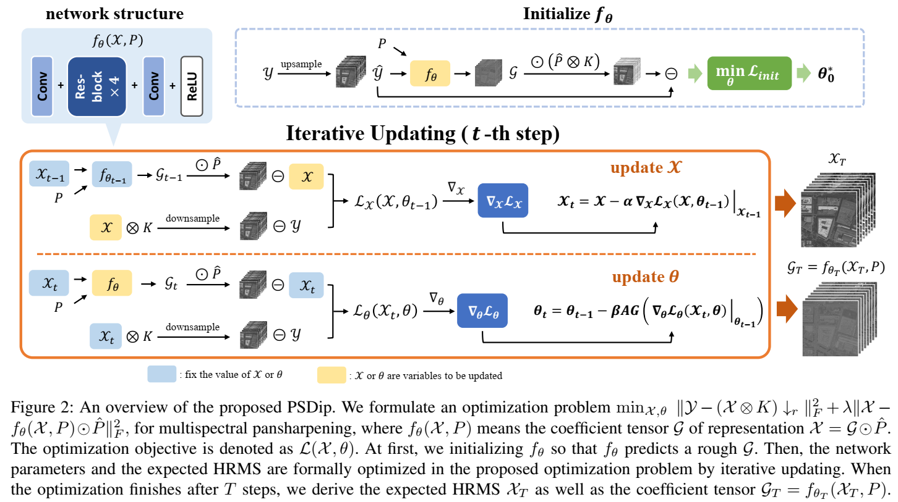

# Variational Zero-shot Multispectral Pansharpening

[arxiv](https://arxiv.org/pdf/2407.06633)

Flowchat of the proposed PSDip. Both the coefficient $\mathcal{G}$ and the expected HRMS $\mathcal{X}$ are variables within one optimization problem. A neural netowrk $f_\theta$ predicts $\G$. Netowork parameters $\theta$ and $\mathcal{X}$ are optimized by iterative updating. 

## Dataset
download benchmark WV2, WV3, QB datasets from [PanCollection](https://liangjiandeng.github.io/PanCollection.html) to your local files.

* .mat format could be used to directly run the code.
* .hd format is also available. Then, please change the data load way in PSDip.py and PSDip_f.py.

Please also change the data dir in line 69 in PSDip.py or line 67 in PSDip_f.py.

## Run the code
Please run ``python3 PSDip.py -sensor <sensor> -init`` for reduced resolution experiments.

run ``python3 PSDip_f.py -init`` for full resolution experiments.

e.g. ``python3 PSDip.py -sensor WV2 -init``

The restored HRMS image will be directly saved in 'results/..' files. 

## Connections
<a href="mailto:xyrui.aca@gmail.com">xyrui.aca@gmail.com</a> 

